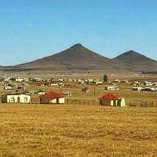

# Gxojeni Weather Project

I will be using Open Weather Map to get weather focus for the next five days.

## Call 5 day / 3 hour forecast data
- You can search weather forecast for 5 days with data every 3 hours by geographic coordinates.
- api.openweathermap.org/data/2.5/forecast?lat={lat}&lon={lon}&appid={API key}

## How to use
- Please click the [link](https://kanyisa-ntombini.github.io/gxojeni/) to view the live website. 

## Features
- Bad ass stuff!!

## Technologies
- HTML
- CSS
- Javascript
- Jasmine
- Webpack
- Postman

## Important links

### Weather triggers
- Used to create triggers which will fire on an occurrence of the selected weather conditions (temperature, humidity, pressure, etc.)
- https://openweathermap.org/triggers

### Air Pollution API
- https://openweathermap.org/api/air-pollution

### API for Coordinates - Geocoding API
- http://api.openweathermap.org/geo/1.0/direct?q={city name},{state code},{country code}&limit={limit}&appid={API key}